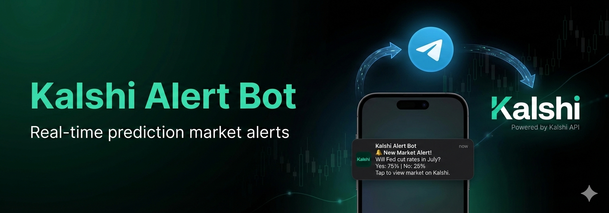

<p align="center">
  
</p>

# Kalshi Alert Bot

A minimal Telegram bot that sends real-time alerts for Kalshi prediction markets using WebSocket integration.

## Features

- 📊 Real-time market price alerts with market titles and direct links
- 🔔 Subscribe to markets by ticker or URL
- 💾 Persistent subscription storage (SQLite)
- 🔄 Automatic reconnection on disconnects
- 📈 Price change notifications (>5 cent movements)
- 🔗 Clickable links to view markets on Kalshi.com

## Prerequisites

- Python 3.8+
- Telegram account
- Kalshi account (for API access)

## Setup Instructions

### 1. Install Dependencies

```powershell
# Create a virtual environment (recommended)
python -m venv venv
.\venv\Scripts\Activate.ps1

# Install required packages
pip install -r requirements.txt
```

### 2. Create Telegram Bot

1. Open Telegram and search for [@BotFather](https://t.me/BotFather)
2. Send `/newbot` command
3. Follow the instructions to create your bot
4. Copy the bot token (looks like `123456789:ABCdefGHIjklMNOpqrsTUVwxyz`)

### 3. Get Kalshi API Credentials

1. Create an account at [kalshi.com](https://kalshi.com)
2. Go to [API Keys Settings](https://kalshi.com/account/api-keys)
3. Click "Generate New API Key"
4. Download the private key file (`.pem`) - **Save this securely, you can't download it again!**
5. Copy your API Key ID (looks like `a1b2c3d4-e5f6-...`)
6. Note: The bot uses ONE set of API credentials to connect to Kalshi's WebSocket API for all users

### 4. Configure Environment Variables

```powershell
# Copy the example environment file
Copy-Item .env.example .env

# Edit .env file with your credentials
notepad .env
```

Add your credentials:
```
TELEGRAM_BOT_TOKEN=your_telegram_bot_token_here
KALSHI_API_KEY_ID=your_api_key_id_here
KALSHI_PRIVATE_KEY_PATH=C:\path\to\your\private_key.pem
PRICE_CHANGE_THRESHOLD=0.05
```

**Important:**
- Use the full absolute path for `KALSHI_PRIVATE_KEY_PATH`
- Keep your private key file secure and never commit it to git

### 5. Run the Bot

```powershell
python bot.py
```

You should see output like:
```
2025-12-15 10:30:00 - __main__ - INFO - Starting Kalshi Alert Bot...
2025-12-15 10:30:01 - kalshi_client - INFO - Private key loaded successfully
2025-12-15 10:30:02 - kalshi_client - INFO - Connecting to Kalshi WebSocket...
2025-12-15 10:30:02 - kalshi_client - INFO - Connected to Kalshi WebSocket
2025-12-15 10:30:02 - __main__ - INFO - Telegram bot started
```

## Usage

### Bot Commands

Open your bot in Telegram and use these commands:

- `/start` - Welcome message and introduction
- `/subscribe <TICKER or URL>` - Subscribe to market alerts
  - Example: `/subscribe KXHARRIS24-LSV`
  - Example: `/subscribe https://kalshi.com/markets/kxharris24/...`
- `/unsubscribe <TICKER>` - Unsubscribe from market alerts
- `/list` - Show all your subscribed markets
- `/help` - Display help message

### Subscribing to Markets

**Option 1: By Ticker**
1. Visit [kalshi.com](https://kalshi.com)
2. Browse or search for markets
3. Find the ticker on the market page (e.g., `KXHARRIS24-LSV`)
4. Use `/subscribe KXHARRIS24-LSV`

**Option 2: By URL (Easy!)**
1. Copy any Kalshi market URL
2. Paste it with `/subscribe` command
3. The bot will automatically extract the ticker and subscribe you

### Example Workflow

```
You: /start
Bot: 🤖 Welcome to Kalshi Alert Bot! ...

You: /subscribe KXHARRIS24-LSV
Bot: ✅ Subscribed to KXHARRIS24-LSV
     Harris Kamala to win 2024 US Presidential Election
     Current: 45-46¢

     You'll receive alerts when prices change significantly.

[Later, when price changes...]
Bot: 📈 Price Alert

     Harris Kamala to win 2024 US Presidential Election
     KXHARRIS24-LSV

     Bid: 45¢ → 52¢ 🔼 (+7¢)
     Ask: 46¢ → 53¢ 🔼 (+7¢)

     [View Market on Kalshi](https://kalshi.com/markets/...)

You: /list
Bot: 📊 Your Subscriptions (1):
     • KXHARRIS24-LSV

You: /unsubscribe KXHARRIS24-LSV
Bot: ✅ Unsubscribed from KXHARRIS24-LSV
```

## Project Structure

```
kalshi-alert-bot/
├── bot.py                    # Main bot logic and Telegram handlers
├── kalshi_client.py          # Kalshi WebSocket client
├── subscription_manager.py   # SQLite subscription management
├── requirements.txt          # Python dependencies
├── .env                      # Environment variables (create from .env.example)
├── .env.example             # Example environment variables
├── .gitignore               # Git ignore rules
└── subscriptions.db         # SQLite database (created automatically)
```

## How It Works

1. **Telegram Bot**: Handles user commands and sends alerts
2. **Kalshi WebSocket Client**: Maintains connection to Kalshi's real-time API
3. **Subscription Manager**: Stores user subscriptions in SQLite database
4. **Alert Logic**: Monitors price changes and sends alerts when threshold is exceeded

### Architecture

```
User → Telegram Bot → Subscription Manager → SQLite DB
                 ↓
         Kalshi WebSocket Client
                 ↓
         Real-time Market Data
                 ↓
         Alert Logic → Telegram Bot → User
```

## Configuration

### Alert Threshold

Modify `PRICE_CHANGE_THRESHOLD` in `.env` to adjust alert sensitivity:
- `0.05` = 5 cent change (default)
- `0.01` = 1 cent change (more sensitive)
- `0.10` = 10 cent change (less sensitive)

## Error Handling

The bot includes:
- Automatic WebSocket reconnection on disconnect
- Re-subscription to markets after reconnection
- Graceful handling of invalid tickers
- Logging of all errors and events

## Troubleshooting

### Bot doesn't start

```powershell
# Check if environment variables are set
Get-Content .env

# Verify Python version (should be 3.8+)
python --version

# Check if dependencies are installed
pip list | Select-String "telegram|websockets|aiohttp"
```

### Authentication fails

- Verify your API Key ID is correct
- Check that the private key file path is correct and accessible
- Ensure the private key file matches the API Key ID
- Confirm your Kalshi account is active
- Check file permissions on the private key file

### WebSocket disconnects frequently

- Check your internet connection
- Review logs for error messages
- The bot will automatically reconnect

### No alerts received

- Verify you're subscribed: `/list`
- Check if the market is actively trading
- Ensure price changes exceed the threshold (default 5 cents)

## Development

### Running in Background (Windows)

```powershell
# Using Start-Process
Start-Process python -ArgumentList "bot.py" -WindowStyle Hidden

# Or use Task Scheduler for automatic startup
```

### Viewing Logs

The bot logs to console. To save logs:

```powershell
python bot.py 2>&1 | Tee-Object -FilePath bot.log
```

## Future Enhancements

Potential features to add:
- Volume alerts
- Trade alerts
- Multiple alert thresholds per ticker
- Market open/close notifications
- Daily summaries
- Market search functionality in bot
- Admin dashboard

## Security Notes

- Keep your `.env` file secure and never commit it
- Use a dedicated Kalshi account for the bot
- The bot stores only Telegram chat IDs and tickers
- Consider using environment-specific credentials

## License

MIT License - feel free to modify and use as needed

## Support

For issues or questions:
1. Check the troubleshooting section
2. Review Kalshi's API documentation
3. Check Telegram bot API documentation

## Credits

Built with:
- [python-telegram-bot](https://python-telegram-bot.org/)
- [websockets](https://websockets.readthedocs.io/)
- [aiohttp](https://docs.aiohttp.org/)
- [Kalshi API](https://kalshi.com/)

---

**Created by [Harish Garg](https://harishgarg.com)**
